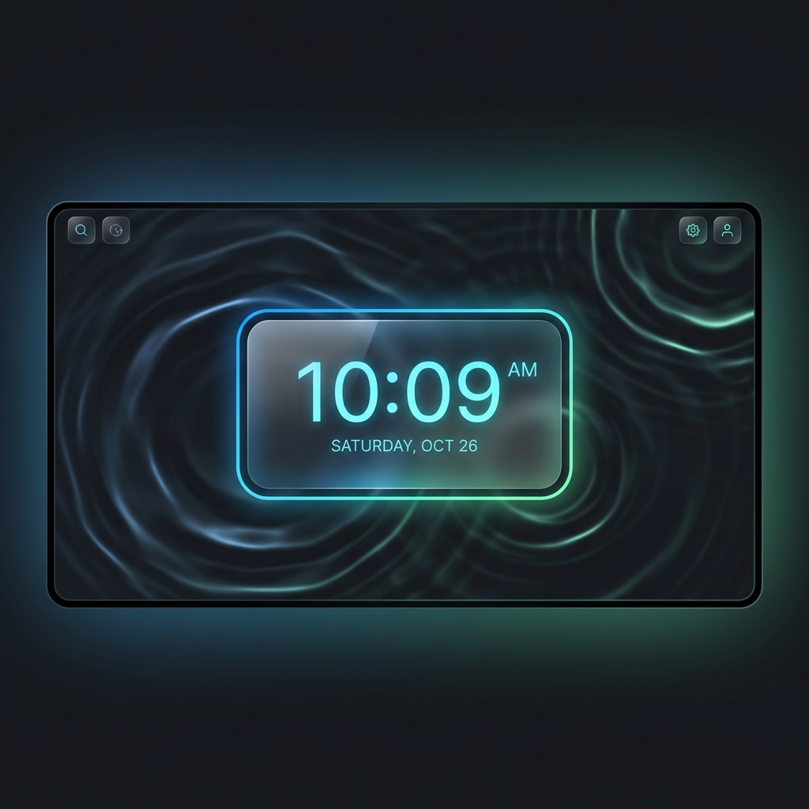

<p align="center">
  
</p>

# 🌌 Aura Tab — Premium Glassmorphic Browser Dashboard

A highly customizable, aesthetic, and feature-rich Chrome/Brave browser extension that transforms your default **New Tab** page into a stunning, liquid glassmorphic workspace dashboard.

<p align="center">
  
  
  
  
  
</p>

---

## ✨ Key Features

### 💎 Liquid Glassmorphic Design System
* **Curated Aesthetics**: Vibrant theme palettes, dynamic backdrop blur adjustments (`backdrop-filter: blur()`), and customizable glass transparency.
* **Premium Shadows & Highlights**: Sleek borders and light-refracting outlines designed to feel highly premium.
* **Modern Typography**: Integrated high-quality sans-serif fonts to replace generic browser defaults.

### 📐 Resizable & Draggable Layout Grid
* **Layout Edit Mode**: Re-position widgets by dragging them anywhere on the dashboard.
* **Dynamic Scaling (New!)**: Increase or decrease widget sizes dynamically (from `0.5x` to `2.0x` scale) directly on the screen using floating resize controls (`+` and `−`).
* **Instant Reset**: Reset coordinates and scales back to default grid alignment with a single click.

### 🎥 Lossless Live Wallpapers (IndexedDB)
* **Local Offline Storage**: Upload any video (MP4, WebM, MOV) or high-resolution image from your computer. The binary file is saved locally to **IndexedDB**, guaranteeing that it loads instantly on every new tab, works offline, and bypasses CORS blocks.
* **Troubleshooting Logs**: Smart warnings and logs help you resolve unsupported codecs (such as H.265/HEVC or Apple ProRes) by suggesting standard H.264 conversions.

### 📌 Built-in Pinterest Downloader & Streamer
* **One-Click Wallpapers**: Paste any Pinterest Pin link (including short `pin.it` links) to instantly extract the original maximum-quality video or photo. 
* **Live Wallpaper Streamer**: Click **"Set as Live Wallpaper"** (or **"Set as Wallpaper"**) to download and apply the Pinterest media directly to your dashboard.
* **CORS-Free background fetching**: Routed through service worker fetching to bypass hotlinking blockades and CORS limits.

### 🧘 Zen Mode & Pomodoro Timer
* **Pomodoro Loop**: Fully configurable Pomodoro focus timer with desktop notifications.
* **Zen Space**: A distraction-free, screen-centered flipping clock that hides all widgets.
* **Ambient Nature Loops**: Chrome Offscreen-powered audio loop stream playing Rain, Forest, Ocean waves, or white noise directly in the background.

### 🔍 Unified AI & Web Search Bar
* **Multi-Engine Selector**: Quick-toggle between Google, DuckDuckGo, Bing, and Yahoo.
* **AI Prompt Mode**: Integrated multiline AI prompt input for easy copy-pasting to LLMs.
* **Search History**: Autocomplete suggestions based on your local search history.

### 🛠️ Built-in Quick Tools Drawers
* **Notes Hub**: A clean notepad supporting rich-text, with a right-click context menu to save highlighted text on any webpage directly to your notes.
* **Clipboard Capture**: A clipboard history manager with automatic capture toggles.
* **Tab & Extension Managers**: Easily search, switch, close, or disable active tabs and extensions without leaving the dashboard.

---

## 🛠️ Technology Stack
* **Manifest Version**: MV3 (Manifest V3)
* **Frontend**: Pure Vanilla HTML5, CSS3 Variables, ES6+ Javascript
* **Storage Engines**: 
  - **IndexedDB**: Direct binary storage for video and image wallpaper files.
  - **Chrome Sync Storage**: Synchronizes lightweight text-based configuration and preferences.
  - **Chrome Local Storage**: Saves coordinates, scales, notes, and temporary session states.
* **Audio Routing**: Chrome Offscreen Documents API (for ambient audio loops and timer alerts).

---

## 🚀 Installation Guide (Local Developer Setup)

Since this is a fully customizable developer extension, you can install it locally on your Mac/PC in under a minute:

1. **Clone or Download** this repository to your local system:
   ```bash
   git clone https://github.com/rubenthampy890-del/aura-tab-extension.git
   cd aura-tab-extension
   ```
2. Open Google Chrome, Brave, or any Chromium-based browser.
3. Navigate to **Extensions** (`chrome://extensions` or `brave://extensions`).
4. Enable **Developer Mode** by toggling the switch in the top-right corner.
5. Click the **Load unpacked** button in the top-left corner.
6. Select the folder containing this extension (`custom-tab-extension` or the cloned repository folder).
7. Open a new browser tab (`Cmd + T`) and enjoy your premium glassmorphic dashboard!

---

## 📝 License
This project is open-source and available under the [MIT License](LICENSE).
